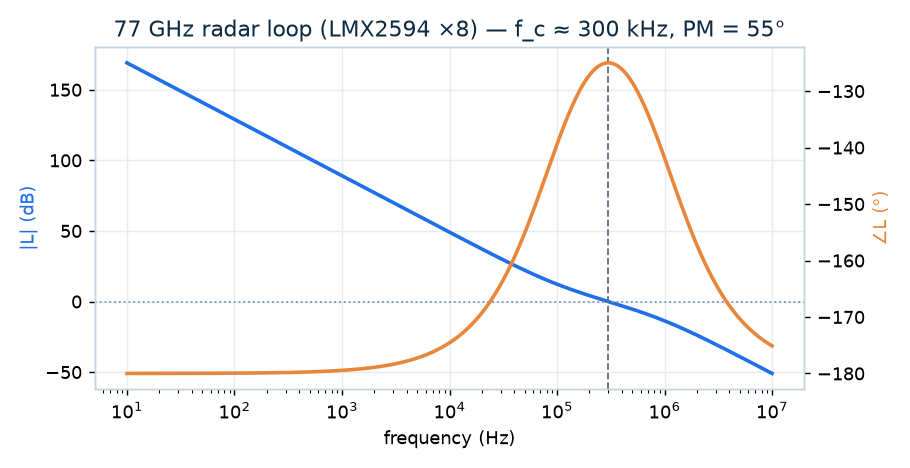
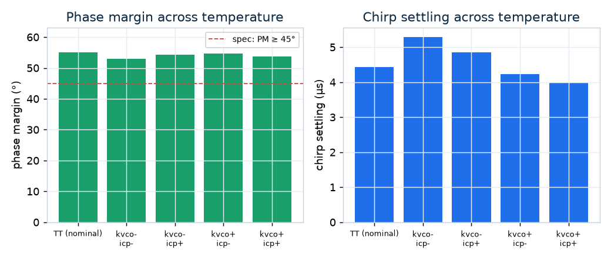
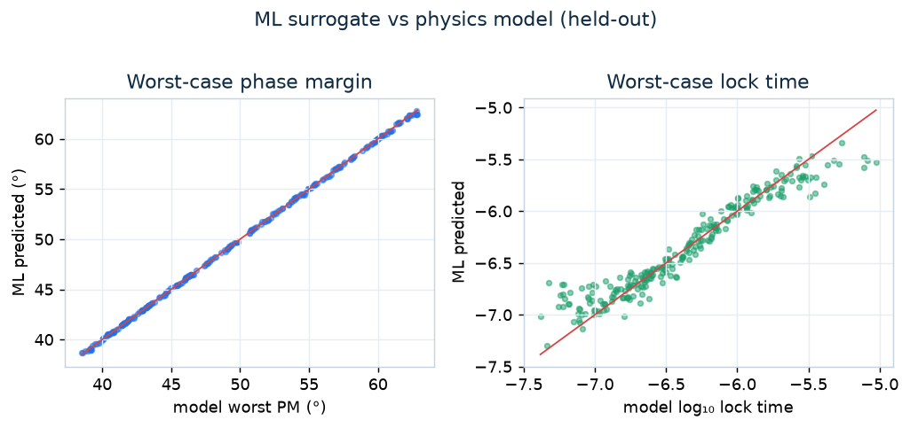

# LockBench

[](https://github.com/snehaprasad11/ControlBench/actions/workflows/ci.yml)

### 🔗 Live app: **https://controlbench.onrender.com**

**Design a charge-pump PLL loop filter for a real synthesizer IC — and prove it holds
across every PVT corner.**

A phase-locked loop is one of the places control theory and VLSI meet: it is a
negative-feedback system on silicon whose *loop filter* must be designed for stability
(phase margin), speed (lock time) and low jitter — the same quantities classical control
measures. LockBench takes a **real** synthesizer IC (Analog Devices ADF4351/ADF5355,
TI LMX2594), designs its passive loop filter for target specs, and then does the thing a
textbook design skips: it checks that the design still meets spec when Kvco and Icp drift
across **P**rocess/**V**oltage/**T**emperature. A machine-learning surrogate makes the
inverse problem — *"given my specs, what design?"* — instant.

It is a full-stack app: a **Python engine** exposed through a **FastAPI** backend, with a
**React (Vite)** frontend that renders interactive Bode / jitter / lock plots via Plotly.js.

## In action

A real ADF4351 loop (2.4 GHz VCO, 10 MHz PFD) designed for 20 kHz bandwidth and 50° phase
margin — the open-loop Bode shows the type-II phase bump the loop-filter zero provides:



The same design swept across PVT: phase margin stays above the 45° spec, but the worst
corner (low Kvco / low Icp) nearly doubles the lock time — exactly the trade a robust
design must respect:



The ML surrogate reproduces the physics model on held-out designs (worst-case phase margin
near-exactly; lock time with some spread), so it is a safe accelerator for inverse design:



> Figures are regenerated from the live engine with `python scripts/make_figures.py`, and
> the full ML story is in [`notebooks/05_pll_ml_surrogate.ipynb`](notebooks/05_pll_ml_surrogate.ipynb).

## The PLL as a control loop

```
 ref phase ─▶(PFD)─▶ charge pump ─▶ loop filter ─▶  VCO   ─▶ out phase
                       Icp/2π         Z(s)=R,C1,C2   Kvco/s
              ▲                                                  │
              └──────────────────  ÷ N  ◀────────────────────────┘

              Icp · Kvco     (1 + s R C1)
   L(s) =  ─────────────  ·  ───────────         (open-loop gain; type-II loop)
              2π · N              s² C1
```

- **Plant** (fixed by the chip): charge pump, VCO (`Kvco/s`, a pure integrator) and `÷N`.
- **Controller** (what you design): the **loop filter** `Z(s)` — its `R, C1, C2` — plus `Icp`.
- Two poles at the origin make it **type-II**, so the filter's **zero** is what buys back
  phase margin. LockBench synthesises `R, C1, C2` with the standard third-order passive
  (Banerjee) method, then *measures* the achieved bandwidth/margin back from `L(s)` — the
  design is verified, not just asserted (see `tests/test_pll.py::test_design_hits_targets`).

## What makes it real (and defensible)

- **Anchored on real silicon.** `data/pll_devices.json` holds datasheet-cited parameters
  (Kvco, charge-pump current options, PFD max, VCO range, phase noise) for shipping parts,
  each row linked to its manufacturer datasheet. Designs are sanity-checked against those
  published specs.
- **PVT-corner robustness — the point of the tool.** A design is only trustworthy if it
  holds phase margin, lock time and jitter peaking across the whole box of Kvco/Icp
  variation. LockBench sweeps the corners, reports worst-case, and flags spec violations.
- **ML surrogate + inverse design.** A random forest predicts *worst-case-across-PVT*
  metrics from a design point in milliseconds, and inverts that to recommend a design from
  target specs. **Honesty note:** the surrogate's *training rows* are generated by the
  linear PLL model (fast, exact for the model); the **real datasheet library is the
  grounding and validation**, not the ML training set. That distinction is deliberate.

## Metrics, in datasheet language

| Control-loop quantity | PLL name | Why a chip designer cares |
|---|---|---|
| Phase margin | Phase margin | Stability; target ~45–60° |
| Gain-crossover frequency | **Loop bandwidth** | Speed vs. noise/spur trade-off |
| Settling time | **Lock time** | How fast the PLL locks (a real spec) |
| Closed-loop peaking | **Jitter peaking** (dB) | Jitter amplification; SerDes wants < ~1 dB |

## Architecture

```
React + Vite frontend  ──HTTP/JSON──▶  FastAPI backend  ──▶  controlbench.pll engine
 (Plotly Bode/lock)                    (REST + Swagger)       (devices · model · design
                                                               · metrics · corners · ml)
```

## Install

```bash
pip install -r requirements.txt        # engine + API (runtime)
pip install -r requirements-dev.txt    # + tests and notebooks
```

## Run the app

```bash
# terminal 1 — API
uvicorn api.main:app --reload

# terminal 2 — React frontend (proxies /api to the backend)
cd frontend
npm install      # first time only
npm run dev      # open http://localhost:5173
```

### API only

- Interactive Swagger docs: http://127.0.0.1:8000/docs
- `GET  /api/devices`   — the real, datasheet-anchored device library
- `POST /api/design`    — design a loop filter; return filter, metrics, PVT sweep, plots
- `POST /api/explore`   — search the design space for PVT-robust designs, ranked
- `POST /api/recommend` — ML inverse design: suggest a design point from target specs

```bash
curl -X POST http://127.0.0.1:8000/api/design \
  -H "Content-Type: application/json" \
  -d '{"device_id":"adf4351","f_out_hz":2.4e9,"f_pfd_hz":10e6,"fc_hz":20e3,"phase_margin_deg":50}'
```

## Rebuild the ML surrogate

```bash
python scripts/build_pll_ml.py 1200   # -> data/pll_dataset.csv, models/pll_surrogate.joblib
```

## Tests

```bash
pytest
```

The key test, `test_design_hits_targets`, designs a loop for a target bandwidth and phase
margin and then measures those back from the transfer function — proving the design math.

## Project layout

```
controlbench/
  pll/              # the PLL engine
    devices.py      #   real device library loader
    model.py        #   PLLModel / LoopFilter -> open-loop L(s), closed-loop H(s)
    design.py       #   Banerjee 3rd-order passive loop-filter synthesis
    metrics.py      #   loop bandwidth, phase/gain margin, lock time, jitter peaking
    corners.py      #   PVT corner generation
    robust.py       #   corner sweep, spec check, robust design-space search
    ml.py           #   surrogate + inverse design
  analysis/ controllers/ ranking.py …   # the underlying LTI control engine LockBench is built on
api/                # FastAPI backend (REST API)
frontend/           # React + Vite app (Plotly charts)
data/pll_devices.json   # the real, datasheet-anchored device library
notebooks/          # 05_pll_ml_surrogate.ipynb — the ML story, end to end
scripts/            # build_pll_ml.py, make_figures.py, and legacy demos
docs/img/           # README figures (regenerated by make_figures.py)
tests/              # pytest suite
```

## Limitations & scope

Stated plainly, because the honest scope is part of the engineering:

- **Linear loop model.** LockBench uses the standard continuous-time linear PLL model
  (Gardner's charge-pump approximation). It captures loop dynamics — bandwidth, margin,
  lock, peaking — but not sampling effects near f_PFD, charge-pump nonlinearity/dead-zone,
  or true phase noise. Loop bandwidth is kept well below f_PFD, where this model holds.
- **Kvco across the band.** Real VCO gain varies with the tuning band; the device library
  uses a representative Kvco per part (flagged in each `source_notes`) and lets the PVT
  sweep perturb it ±30%. Band-resolved Kvco tables are a natural extension.
- **Lock time** is defined here as the settling of the closed-loop phase step to ±2% — a
  clean, model-consistent proxy for the datasheet's frequency-settling spec.
- **Reference spurs** are not yet modelled (they depend on ripple and the higher-order
  pole); only the metrics above are computed.
- **ML ground truth is the linear model, not SPICE/silicon.** The surrogate accelerates
  search over that model; extending the ground truth to a behavioural/transistor-level
  model is the clear next step.

## Deploy

See [DEPLOY.md](DEPLOY.md) — one Docker service on Render (free) serving the API and the
built frontend at a single URL.

---

*LockBench grew out of a general control-systems controller comparator; that LTI engine
(`controlbench/analysis`, `controllers`, `ranking`) still underpins the PLL layer.*
